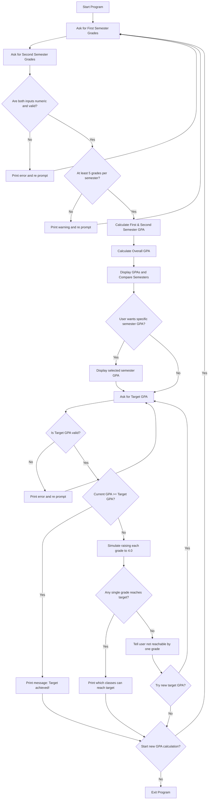

# GPA Calculator

## Overview
This program is an interactive GPA Calculator that helps students calculate their academic performance across two semesters. It allows users to input grades, calculate their semester and overall GPA, and even experiment with improvements to see how raising certain grades might affect their final GPA.


---

## Features
- Accepts two semesters of grades (at least 5 per semester).  
- Calculates:
  - GPA for each semester.  
  - Overall cumulative GPA.  
- Compares GPA between semesters and provides feedback.  
- Allows users to set a target GPA.  
- Simulates what would happen if certain grades were improved to a 4.0.  
- Offers the option to restart or set a new target GPA.

---

## Requirements
- Python 3.6+  
- No external libraries are required. This program only uses Python’s built-in functions.

---

## How to Run
1. Save the script as `gpa_calculator.py`.  
2. Open a terminal or command prompt.  
3. Navigate to the folder containing the script.  
4. Run the program using:
   ```bash
   python gpa_calculator.py
## How It Works


